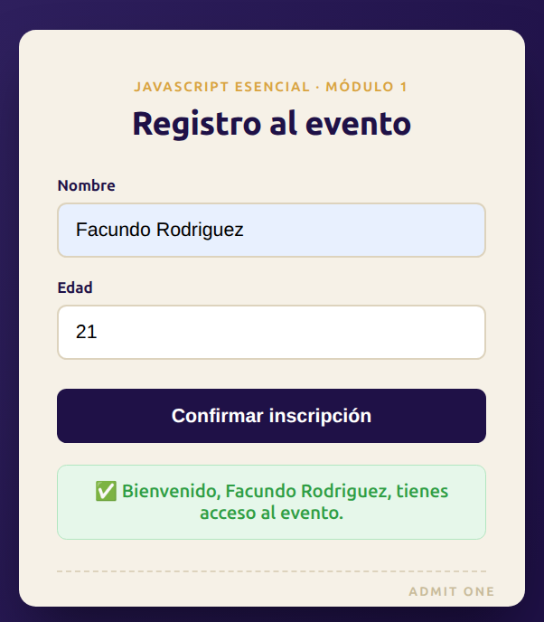
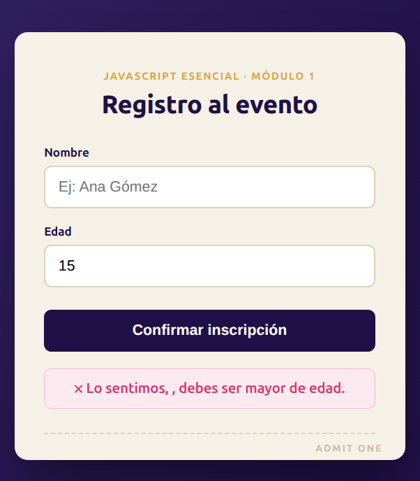

# tarea-2-utn-fullstack

# 📝 Registro al Evento — Validación con JavaScript

**Curso:** JavaScript Esencial — Centro de e-Learning UTN BA  
**Módulo:** 1 — Unidad 2  
**Autor:** Facundo Rodriguez

---

## 📸 Capturas de pantalla




---

## 📋 Descripción

Formulario interactivo de inscripción a un evento, desarrollado como entrega del módulo "JavaScript Esencial". El usuario ingresa su nombre y edad, y al enviar el formulario JavaScript valida si es mayor de edad, mostrando un mensaje dinámico en pantalla. Aplica declaración de variables (`let`, `const`), operadores de comparación, funciones, selección de elementos del DOM con `querySelector`, manejo de eventos con `addEventListener`, prevención del comportamiento por defecto del formulario y estilos condicionales aplicados dinámicamente con `classList`.

---

## 🚀 Cómo clonar y abrir el proyecto

```bash
# 1. Clonar el repositorio
git clone https://github.com/FARO1993/tarea-2-utn-fullstack.git

# 2. Ingresar a la carpeta
cd registro-evento-utn-fullstack

# 3. Abrir el archivo en el navegador
# En Windows:
start index.html
# En Mac:
open index.html
# En Linux:
xdg-open index.html
```

No requiere servidor ni dependencias. Se abre directamente en el navegador.

---

## 📚 Bibliografía y créditos

**Referencias:**
- Flanagan, D. *JavaScript: The Definitive Guide*. 7ª ed. Estados Unidos: O'Reilly Media, 2020.
- Freeman, E. y Robson, E. *Head First JavaScript Programming*. 1ª ed. Estados Unidos: O'Reilly Media, 2014.
- MDN Web Docs. *Document: querySelector() method*. Mozilla Corporation. https://developer.mozilla.org/en-US/docs/Web/API/Document/querySelector
- MDN Web Docs. *EventTarget: addEventListener() method*. Mozilla Corporation. https://developer.mozilla.org/en-US/docs/Web/API/EventTarget/addEventListener
- MDN Web Docs. *Event: preventDefault() method*. Mozilla Corporation. https://developer.mozilla.org/en-US/docs/Web/API/Event/preventDefault
- Anthropic. Claude (modelo de inteligencia artificial). Utilizado como asistente para la generación y revisión del código HTML, CSS y JavaScript de este proyecto. https://www.anthropic.com
